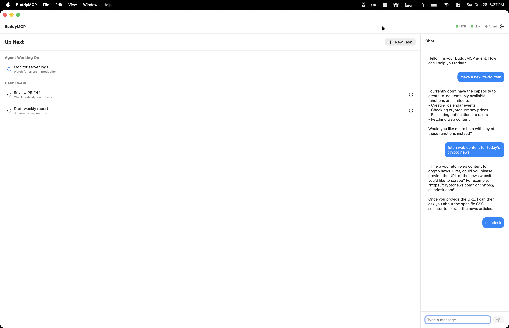

# BuddyMCP: Your Local Agentic Companion

BuddyMCP is a native macOS application that serves as a personal AI agent. It integrates with your local environment (Calendar, Todo List, System Notifications) and external tools via the **Model Context Protocol (MCP)**. Powered by local LLMs (via Ollama), BuddyMCP keeps your data private while offering powerful automation capabilities.



## 🌟 Key Features

*   **Local-First AI**: Connects to local LLMs (like Llama 3, Qwen) using Ollama. No cloud API keys required by default.
*   **"Up Next" Timeline**: A unified view of your tasks and the agent's planned actions.
*   **MCP Support**: Fully supports the Model Context Protocol. Add any MCP server (Stdio or SSE) to extend the agent's capabilities.
*   **Human-in-the-Loop**: Critical actions require your approval. The app notifies you when the agent needs permission to proceed.
*   **Graph Memory**: A built-in graph database allows the agent to remember facts and relationships about you over time.
*   **Native Integration**: Works with macOS Calendar and Reminders (EventKit) and System Notifications.

## 🚀 Getting Started

### Prerequisites

1.  **macOS 14.0+** (Sonoma or later).
2.  **Xcode 15+** (for building from source).
3.  **[Ollama](https://ollama.com)** installed and running.
    *   Pull the default model: `ollama pull qwen3:8b` (or `llama3.2`).

### Installation

1.  Clone the repository:
    ```bash
    git clone https://github.com/yourusername/BuddyMCP.git
    cd BuddyMCP
    ```

2.  Run the application:
    ```bash
    cd MCP-Agent
    swift run
    ```

3.  (Optional) Package as an App Bundle:
    ```bash
    ./package_app.sh
    # Move BuddyMCP.app to your Applications folder
    ```

## 📖 Usage Guide

### The Chat Interface
*   **Ask questions**: "What should I do next?", "What's on my calendar?"
*   **Give commands**: "Add a task to buy groceries", "Remember that I like spicy food."
*   **Status**: The chat shows what the agent is doing ("Thinking...", "Calling tool..."). Errors are displayed inline if something goes wrong.

### Managing MCP Servers
1.  Click the **Gear Icon** in the top right to open Settings.
2.  **Add Server**:
    *   **Command (Stdio)**: Run local MCP servers.
        *   *Example*: `npx -y @modelcontextprotocol/memory`
    *   **Remote (SSE)**: Connect to HTTP-based MCP servers.
        *   *Example*: `http://localhost:8000/sse`
3.  **Manage Tools**: Enable or disable specific tools from any connected server in the "Tools" tab.

### Approvals
Some tools (like creating calendar events or writing to memory) may require confirmation.
*   When the agent tries to use these tools, an **"Action Required"** item appears at the top of the "Up Next" timeline.
*   Click **Approve** to let the agent proceed or **Deny** to stop it.

## 🛠️ Architecture

BuddyMCP is built with **SwiftUI** and follows a modular architecture:

*   **`MCPManager`**: The core engine that discovers, connects to, and manages MCP servers. It handles the JSON-RPC communication for Stdio and SSE.
*   **`LLMManager`**: Manages the connection to the LLM (Ollama/OpenAI). It handles prompt construction, context injection, and streaming responses.
*   **`TaskManager`**: Manages the user's todo list and the agent's task queue.
*   **`GraphMemoryManager`**: A lightweight, local graph database for agent long-term memory.
*   **`WatchdogService`**: Monitors the application's health.

## 🧩 Extending Internal Tools

BuddyMCP comes with built-in tools (Calendar, Todo, Memory). You can add more by modifying `MCPManager.swift`:

1.  Define the tool schema in `discoverInternalTools()`.
2.  Implement the logic in `callInternalTool()`.

## 🤝 Contributing

Contributions are welcome! Please feel free to submit a Pull Request.

## 📄 License

This project is licensed under the MIT License.
